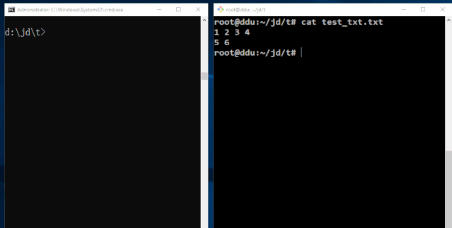

<span style="float:left">

</img>
</span>

<pre>

</pre>




# README 


## tfr synopsis

tfr, original name "tor-fr", is a productive tool that sync-up and share your files, directories instantly, efficently and elegantly.

in the very beginning, Jidor Tang /[github](https://github.com/tlqtangok)/ and LjessonS Liu /[github](https://github.com/LjessonS)/ start this project 
to help themselves to solve many frequently small files and folder transferring from A-machine to B-machine. But eventually, Jidor Tang
found it is so usefully, so we begin to have it go "open source" at 2019-06-26, ShenZhen, China.

## supported platform or OS


platform | download | info | command download
---|---|---|---
Linux | [download](https://raw.githubusercontent.com/tlqtangok/tfr/master/rel/linux/tfr) | x64 Linux | `curl https://raw.githubusercontent.com/tlqtangok/tfr/master/rel/linux/tfr > tfr`
Windows | [download](https://raw.githubusercontent.com/tlqtangok/tfr/master/rel/win/tfr.exe) | x64 Win7/Win10 | `curl https://raw.githubusercontent.com/tlqtangok/tfr/master/rel/win/tfr.exe > tfr.exe`
Pi | [download](https://raw.githubusercontent.com/tlqtangok/tfr/master/rel/pi/tfr) | Raspaberry Pi 3 B+, armv7 | `curl https://raw.githubusercontent.com/tlqtangok/tfr/master/rel/pi/tfr > tfr`
Macintosh | [download](https://raw.githubusercontent.com/tlqtangok/tfr/master/rel/darwin/tfr) | Macintosh/Apple/Darwin | `curl https://raw.githubusercontent.com/tlqtangok/tfr/master/rel/darwin/tfr > tfr`


this are these already tested platforms, actually, it should work on more platforms. let me know if it works for you.

## deps & env

### install some cpan packages you need. 
please firstly set up your environment by following command:

```
sudo cpan -i pp
sudo cpan -i Redis
sudo cpan -i Term::ReadKey
sudo cpan -i Term::ProgressBar
```
### set up you redis-server
you need have your redis-server startup. and remember its host ip and port.
and then you need run a command to set up version key in your DB.

```
redis-cli -h <HOSTNAME> set TOR_FR_VERSION_KEY 2019.04.01
```

where the "2019.04.01" may be changed as time goes, but should be the same with the version number in source code `tfr.PL`.

## to build

the build system is smart enough , just run:
``` 
perl build.PL
```

you will get the executed file.


## before your run
the default redis host ip is your localhost. but you can change that by putting the `tfr.config` file to the same folder as your 
binary file `tfr.exe (windows)` or `tfr (non-windows)`. you can tune it a bit as your wish.

## usage

**synopsis**

```
tfr tor <filename> [-pw <your_password>]
tfr fr [jd_xx]
tfr -v
```

### Tor

**synopsis**


**usage example**

*show version* 

```
tfr -v
```

*pass stdin*
```
echo 'xxxx' | tfr tor

```

*pass string as argument*
```
tfr tor 'xxx'
```


*pass file as argument*
```
tfr tor main.cpp
```


*pass folder*
```
tfr tor my_folder_name 
tfr tor .
tfr tor /a/b/c/you_path_of_file_or_directory
tfr tor `pwd`
```


### Fr

*no jd_xx arg*
```
tfr fr 
```


*has jd_xx*
```
tfr fr jd_xx
```
*has jd_xx and -pw*
```
tfr fr jd_xx -pw <your_password>
tfr fr -pw <your_password>
```

## to do
- more test cases 

## change log 

[see here](./commit_history/change_log.md)


## reference 
[redis source code](https://github.com/antirez/redis)

[福利 | 超好用多平台云分享工具](https://mp.weixin.qq.com/s?timestamp=1561559104&src=3&ver=1&signature=59xJxK9B*CWz259f8uE*Sb8dS-ANTWflxTRs*62NYNWR7IYaZ8QBkxXHWcEOZvXYQwjxoiBaYeDTXCOzeqgZmYnrVg*W*zcFecT85IKsTalOgklBlMKwUUQmgCNiuCiTJLFkDiBMV-hZ--ZHZ7AS1Gi1FDo48Jk7uOJ1vZLkFdM=)

[写一个 tor-fr 会遇到哪些难点](https://mp.weixin.qq.com/s?timestamp=1561559104&src=3&ver=1&signature=59xJxK9B*CWz259f8uE*Sb8dS-ANTWflxTRs*62NYNWR7IYaZ8QBkxXHWcEOZvXYQwjxoiBaYeDTXCOzeqgZmWv6IOZiT4g*PWJFdeseE9*Q26Ceokk*sTk*3T81gnjMisM20q8LIBxJC0AAQ3WTgeRCK8FhJkx-s15Zmi11C6A=)


<br>
<br>

---
<div syle="font-size:41px" align=right >
    Written by Jidor Tang tlqtangok@126.com. Copyright 2018-2019
</div>
